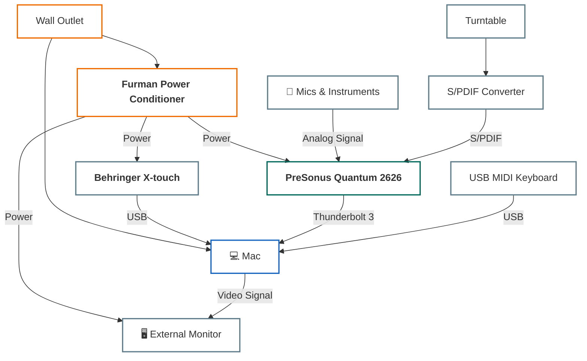

---
hide:
  - toc
---

# 🎹 My Audio Production Setup

This document provides a detailed overview of my audio production environment. The goal is a seamless and automated workflow centered around **REAPER**, the **PreSonus Quantum 2626** audio interface, and a set of custom scripts that tie the hardware and software together. The entire system is designed for single-switch power management, making startup and shutdown incredibly simple.

This guide is designed to be a complete reference for replicating the setup from scratch.

---

## Hardware & Connectivity

The physical setup uses a central power conditioner to manage peripherals, with data and audio signals routed through the Quantum 2626 interface.

### Core Components

  * **Furman Power Conditioner:** All hardware, *except the Mac*, is plugged into this unit. Turning it on or off controls power to the entire studio in one step.
  * **PreSonus Quantum 2626**: An 8-in/8-out audio interface with the option for ADAT expansion.
  * **Behringer X-touch**: A USB/MIDI fader controller used for controlling REAPER's mixer, transport, and plugin parameters via the DrivenByMoss extension.
  * **Touchscreen Monitor**: Connected to the Mac while it is in clamshell mode.
  * **Analog Sources:**
      * A turntable with a built-in phono preamp.
      * Guitar
      * Bass
      * 4 Microphones
  * **Digital Sources:**
      * USB MIDI Keyboard

### System Flow Graph

This diagram illustrates how power, audio, and data signals are routed through the system.



---

## ⚙️ Workflow & Procedures

The setup is designed around a simple, two-step process for both starting and stopping a session.

### Startup Procedure

1.  **Flip the switch on the Furman Power Conditioner.** This provides power to the audio interface, monitor, and all other connected peripherals.
2.  **Click the mouse or press a key on the keyboard.** This wakes the Mac from sleep.
3.  The **Hammerspoon script** automatically detects that the Quantum 2626 has reconnected and will **launch REAPER**. The system is now ready to use.

### Shutdown Procedure

1.  **(Optional but Recommended)** Save your current project in REAPER.
2.  **Flip the switch on the Furman Power Conditioner.**
3.  This cuts power to the Quantum 2626, which **triggers the Hammerspoon script**. The script automatically saves the project again, quits REAPER, and puts the Mac to sleep.

### Adding a MIDI Device

If you connect a new MIDI controller while REAPER is already running:

  * Click the **"Reset MIDI"** button in the custom "Big Buttons" UI to force REAPER to rescan and recognize the new device.

---

## 💻 Software Installation

This section covers the installation and configuration of all essential software components. We'll use [Homebrew](https://brew.sh/) for installations on macOS where possible.

### 1\. System-Level Tools

**Hammerspoon** is the core of the system-level automation.

  * **Official Website:** [hammerspoon.org](https://www.hammerspoon.org/)

  * **Installation (macOS):** Open a terminal and run:

    ```sh
    brew install --cask hammerspoon
    ```

      * After installation, launch Hammerspoon. It will create a configuration directory at `~/.hammerspoon/`. This is where the automation script will live.

### 2\. REAPER and Essential Extensions

#### A. Install REAPER

  * Download and install the latest version of **REAPER** from the official website: [reaper.fm](https://www.reaper.fm/).

#### B. Install DrivenByMoss (Manual Installation)

Unlike many other extensions, **DrivenByMoss cannot be installed with ReaPack** and requires a manual setup.

  * **Official Website:** [mossgrabers.de/Software/Reaper](https://www.mossgrabers.de/Software/Reaper/Reaper.html)

**Installation Steps:**

1.  Download the latest version of DrivenByMoss for macOS from the official website.
2.  In REAPER, go to the `Options` menu and select `Show REAPER resource path in explorer/finder...`.
3.  Navigate into the `UserPlugins` folder.
4.  Unzip the downloaded file and copy its **entire contents** into the `UserPlugins` folder.
5.  Restart REAPER to load the extension.

**Configuration Steps:**

1.  In REAPER, go to `Preferences > Control/OSC/web`.
2.  Click the `Add` button.
3.  From the **Control surface mode** dropdown menu, select `DrivenByMoss`.
4.  Set the **MIDI input** and **MIDI output** to your Behringer X-touch (or other control surface).
5.  Click `OK` to save the settings. The control surface should now be active.

#### C. Install ReaPack

**ReaPack** is a package manager for REAPER that automates the installation of scripts, extensions, and themes.

  * **Official Website:** [reapack.com](https://reapack.com/)
  * **Installation Steps:**
    1.  Download the appropriate `.dylib` file for your macOS architecture (Apple Silicon or Intel) from the ReaPack website.
    2.  In REAPER, go to the `Options` menu and select `Show REAPER resource path in explorer/finder...`.
    3.  Open the `UserPlugins` folder.
    4.  Copy the downloaded `.dylib` file into this folder.
    5.  Restart REAPER. ReaPack will now be available under the `Extensions` menu.

#### D. Install Additional Extensions via ReaPack

Now, use ReaPack to install the remaining tools.

**Install Packages:**

1.  Go to `Extensions` \> `ReaPack` \> `Browse packages...`.
2.  In the filter box, search for and install each of the following packages by right-clicking and choosing `Install`:
      * **SWS/S\&M Extension**: A massive extension that adds hundreds of new actions and features.
      * **ReaImGui**: A library that allows ReaScripts to create complex graphical user interfaces.
3.  After selecting the packages, click `Apply` to install them.
4.  Restart REAPER to complete the installation.

---

## 🤖 Automation & Control Layer

### Quantum 2626 & System Automation

The entire system is automated to power on and off based on the connection status of the Quantum 2626 interface. This is handled by a **Hammerspoon script**.

  * **Functionality:**
      * When power to the Quantum 2626 is cut (via the Furman), the script begins a countdown.
      * It then automatically **saves and quits REAPER**, then puts the computer to **sleep**.
      * When the computer **wakes up** and the Quantum 2626 is detected, the script automatically **launches REAPER**.
  * **Full Documentation & Script:**
      * **[See the detailed documentation for the Quantum & REAPER Automation script here.](Scripts/quantum-reaper-automation.md)**

### REAPER Control & Custom UI

#### DrivenByMoss Control Surface

The **DrivenByMoss** extension provides deep integration for MIDI controllers like the **Behringer X-touch**. It adds more functionality and has good defaults.

  * **Official Website:** [mossgrabers.de/Software/Reaper/Reaper.html](https://www.mossgrabers.de/Software/Reaper/Reaper.html)

#### Big Buttons ReaScript

This is a custom **ReaImGui script** that creates a simple window inside REAPER with large, easy-to-click buttons for common actions like refreshing audio devices or MIDI controllers.

  * **Note:** This script is a temporary solution and is planned to be replaced by a more advanced, fully customizable UI built with my **[Control-Canvas](https://github.com/MaxU1301/Control-Canvas)** script.
  * **Full Documentation & Script:**
      * **[See the detailed documentation for the Big Buttons ReaScript here.](Scripts/big-buttons-reascript.md)**