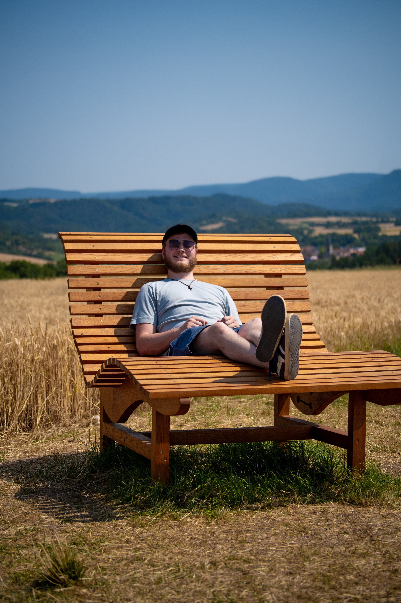

<h1>Welcome</h1>

Just a site that contains things that I want to share. You can look at things like the <a href="/apps/">Apps That I Use</a> or my <a href="/documentation/">Documentation</a>.

<h1>About Me</h1>

<section style="display: grid; grid-template-columns: 160px 1fr; gap: 1rem; align-items: start; margin: 1.5rem 0;">
  

    
  

  

    <h1 style="margin: 0 0 0.25rem 0;">Maximilian (Max) Ullrich</h1>
    
Graduate Mechanical Engineering Student & Researcher • Private Pilot (SEL)

    

      I’m a mechanical engineer and graduate researcher at the University of
      Michigan–Dearborn with hands‑on experience in engineering design,
      manufacturing, and rapid prototyping. I enjoy taking ideas from first
      principles to functional prototypes, and I’m energized by fast feedback
      loops, clear requirements, and measurable results.
    

    

      My background spans lab research, CAD/CAM, and practical build/test work,
      along with technical leadership and operations experience at Fairlane
      Alliance Church. I’ve interned with BECKER CAD‑CAM‑CAST in Germany,
      which strengthened my design-for-manufacture mindset and cross‑cultural
      communication.
    

    

      Outside the lab, I’m a Private Pilot (SEL) and a musician—guitar, drums,
      and piano—including drumming for a bagpipe band. I value systems thinking,
      calm execution, and good documentation.
    

    <ul style="margin: 0.5rem 0 0 1rem; padding: 0;">
      <li>M.S. and B.S., Mechanical Engineering — University of Michigan–Dearborn</li>
      <li>Graduate Student Research Assistant — UM‑Dearborn</li>
      <li>Interests: prototyping, CAD/CAM, test & measurement, controls, aviation</li>
    </ul>

    

      
Let’s connect:

      

        <a href="https://www.linkedin.com/in/maximilian-ullrich-389323168/" target="_blank" rel="noopener" aria-label="LinkedIn">
          <svg xmlns="http://www.w3.org/2000/svg" viewBox="0 0 448 512"><path fill="currentColor" d="M416 32H31.9C14.3 32 0 46.5 0 64.3v383.4C0 465.5 14.3 480 31.9 480H416c17.6 0 32-14.5 32-32.3V64.3c0-17.8-14.4-32.3-32-32.3M135.4 416H69V202.2h66.5V416zM102.2 96a38.5 38.5 0 1 1 0 77 38.5 38.5 0 1 1 0-77m282.1 320h-66.4V312c0-24.8-.5-56.7-34.5-56.7-34.6 0-39.9 27-39.9 54.9V416h-66.4V202.2h63.7v29.2h.9c8.9-16.8 30.6-34.5 62.9-34.5 67.2 0 79.7 44.3 79.7 101.9z"></path></svg>
        </a>
        <a href="https://github.com/MaxU1301" target="_blank" rel="noopener" aria-label="GitHub">
          <svg xmlns="http://www.w3.org/2000/svg" viewBox="0 0 512 512"><path fill="currentColor" d="M173.9 397.4c0 2-2.3 3.6-5.2 3.6-3.3.3-5.6-1.3-5.6-3.6 0-2 2.3-3.6 5.2-3.6 3-.3 5.6 1.3 5.6 3.6m-31.1-4.5c-.7 2 1.3 4.3 4.3 4.9 2.6 1 5.6 0 6.2-2s-1.3-4.3-4.3-5.2c-2.6-.7-5.5.3-6.2 2.3m44.2-1.7c-2.9.7-4.9 2.6-4.6 4.9.3 2 2.9 3.3 5.9 2.6 2.9-.7 4.9-2.6 4.6-4.6-.3-1.9-3-3.2-5.9-2.9M252.8 8C114.1 8 8 113.3 8 252c0 110.9 69.8 205.8 169.5 239.2 12.8 2.3 17.3-5.6 17.3-12.1 0-6.2-.3-40.4-.3-61.4 0 0-70 15-84.7-29.8 0 0-11.4-29.1-27.8-36.6 0 0-22.9-15.7 1.6-15.4 0 0 24.9 2 38.6 25.8 21.9 38.6 58.6 27.5 72.9 20.9 2.3-16 8.8-27.1 16-33.7-55.9-6.2-112.3-14.3-112.3-110.5 0-27.5 7.6-41.3 23.6-58.9-2.6-6.5-11.1-33.3 2.6-67.9 20.9-6.5 69 27 69 27 20-5.6 41.5-8.5 62.8-8.5s42.8 2.9 62.8 8.5c0 0 48.1-33.6 69-27 13.7 34.7 5.2 61.4 2.6 67.9 16 17.7 25.8 31.5 25.8 58.9 0 96.5-58.9 104.2-114.8 110.5 9.2 7.9 17 22.9 17 46.4 0 33.7-.3 75.4-.3 83.6 0 6.5 4.6 14.4 17.3 12.1C436.2 457.8 504 362.9 504 252 504 113.3 391.5 8 252.8 8M105.2 352.9c-1.3 1-1 3.3.7 5.2 1.6 1.6 3.9 2.3 5.2 1 1.3-1 1-3.3-.7-5.2-1.6-1.6-3.9-2.3-5.2-1m-10.8-8.1c-.7 1.3.3 2.9 2.3 3.9 1.6 1 3.6.7 4.3-.7.7-1.3-.3-2.9-2.3-3.9-2-.6-3.6-.3-4.3.7m32.4 35.6c-1.6 1.3-1 4.3 1.3 6.2 2.3 2.3 5.2 2.6 6.5 1 1.3-1.3.7-4.3-1.3-6.2-2.2-2.3-5.2-2.6-6.5-1m-11.4-14.7c-1.6 1-1.6 3.6 0 5.9s4.3 3.3 5.6 2.3c1.6-1.3 1.6-3.9 0-6.2-1.4-2.3-4-3.3-5.6-2"></path></svg>
        </a>
        <a href="mailto:max.g.ullrich@gmail.com" aria-label="Email">
          <svg xmlns="http://www.w3.org/2000/svg" viewBox="0 0 512 512"><path fill="currentColor" d="M48 64C21.5 64 0 85.5 0 112c0 15.1 7.1 29.3 19.2 38.4l208 156a48 48 0 0 0 57.6 0l208-156c12.1-9.1 19.2-23.3 19.2-38.4 0-26.5-21.5-48-48-48zM0 196v188c0 35.3 28.7 64 64 64h384c35.3 0 64-28.7 64-64V196L313.6 344.8c-34.1 25.6-81.1 25.6-115.2 0z"></path></svg>
        </a>
      

    

  

</section>

